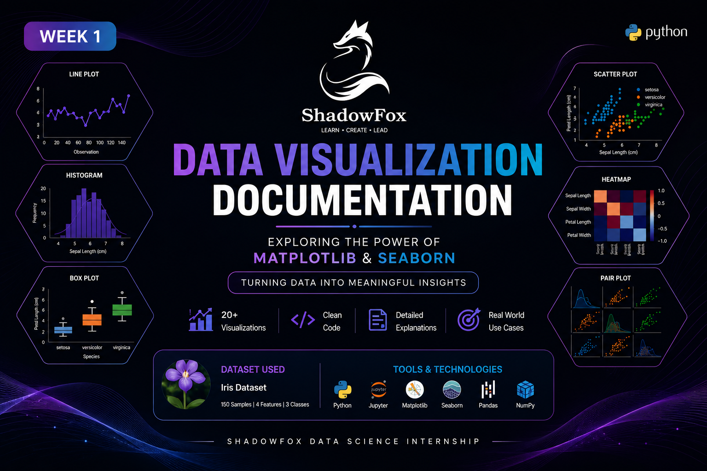
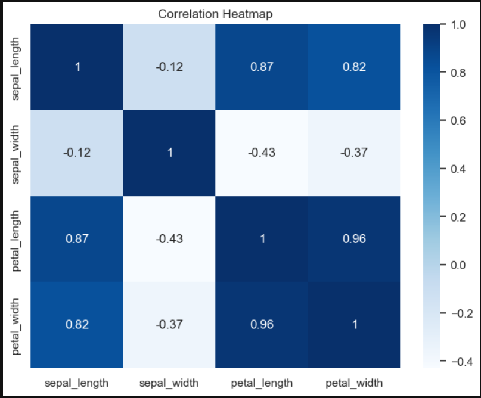
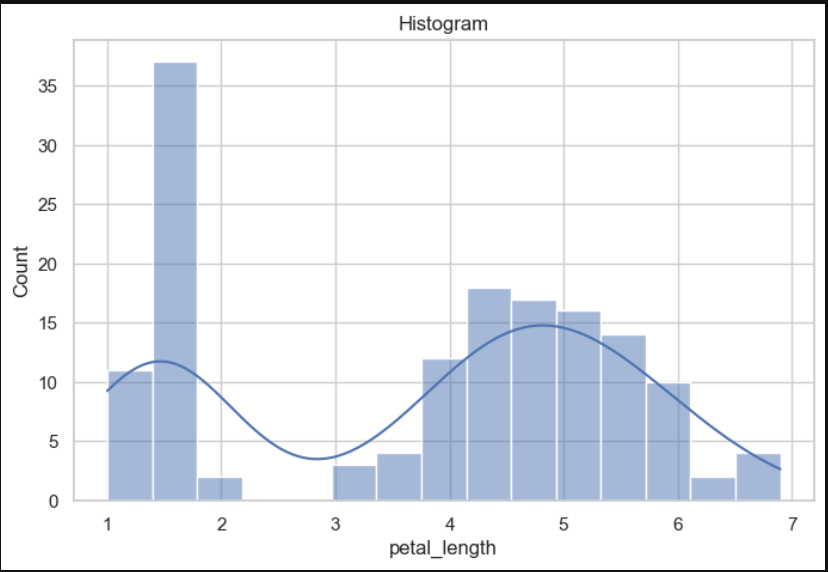

<div align="center">

# 📊 Data Visualization Documentation

<!-- COVER IMAGE -->



### ShadowFox Data Science Internship

Documentation of **Matplotlib** and **Seaborn**

</div>

---

## 📖 Project Objective

The objective of this project is to understand two of Python's most popular visualization libraries, Matplotlib and Seaborn.

This documentation explains various graph types, their implementation, practical use cases, and comparisons using the Iris dataset.

---

## 📚 Libraries Covered

- Matplotlib
- Seaborn

---

## 📂 Dataset

**Dataset Used:** Iris Dataset

Features:

- Sepal Length
- Sepal Width
- Petal Length
- Petal Width
- Species

---

## 📊 Graphs Covered

### Matplotlib

- Line Plot
- Scatter Plot
- Bar Chart
- Histogram
- Pie Chart
- Box Plot
- Area Plot
- Stem Plot
- Subplots
- Save Figure

### Seaborn

- Scatter Plot
- Line Plot
- Bar Plot
- Count Plot
- Histogram
- Box Plot
- Violin Plot
- Heatmap
- Pair Plot

---

## 📸 Output Gallery

<!-- IMAGE GRID -->

| Graph | Preview |
|--------|---------|
| Line Plot |  |
| Scatter Plot |  |
| Area Plot |  |
| Pie Chart |  |
| Heatmap |  |
| Pair Plot |  |
| Histogram |  |

---

## ⚙ Technologies Used

- Python
- Jupyter Notebook
- Pandas
- NumPy
- Matplotlib
- Seaborn

---

## 📈 Key Learning Outcomes

- Data Visualization Fundamentals
- Statistical Visualization
- Exploratory Data Analysis (EDA)
- Choosing the Right Graph
- Comparing Visualization Libraries

---

## 🚀 Project Structure

```text
Week-1-Visualization-Documentation/
│
├── Visualization_Documentation.ipynb
├── Visualization_Documentation.pdf
├── README.md
│
├── images/
│
└── outputs/
```

---

## 📚 References

- [Matplotlib](https://matplotlib.org/)
- [Seaborn](https://seaborn.pydata.org/)
- [NumPy](https://numpy.org/)
- [Pandas](https://pandas.pydata.org/)

---

<div align="center">

Made with ❤️ using Python & Jupyter Notebook

</div>
